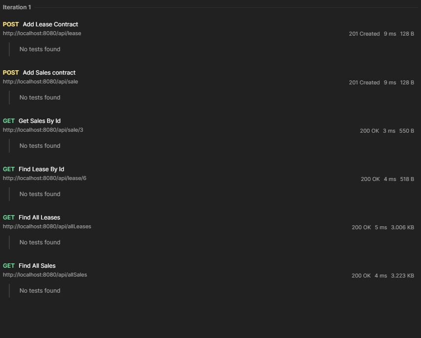

# Card Dealership with REST

## Description

This Project is based on the previous car workshop projects. When running the sql script that is provided in the resources
folder of this app you are able to crate the database and make RESTful requests. You are able to get  a variety of vehicles,
sales and lease contractions. With this we are able to send information to the front end for them to manipulate and display
as needed. 

## What is different this time?? 

Well not a lot has changed. The point of this was to create the RESTful web service using spring boot. The database is the 
same as well as the models. However, the data sources and DAO classes are injected in runtime so that spring can handle 
the instantiation process. 

## But how do we use it??

By using a fetch request application like postman or insomnia, we are able to send Get, Post, Put, and Delete requests 
to test out our application. While using this applications we can run tests to see if we get correct status codes.

Below are some tests that I ran and that are included inside this project. All of the codes have some kind of 200 status code
meaning that they get a good response and have passed the test.

